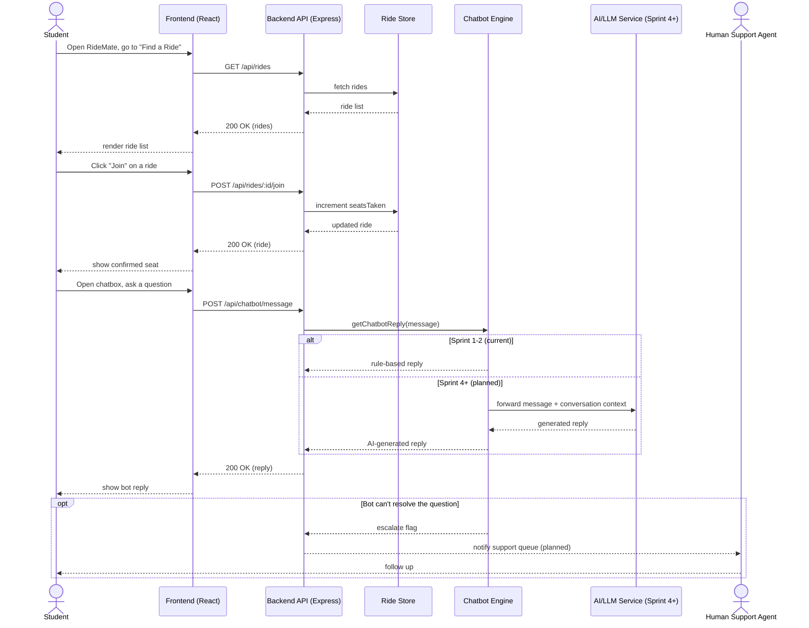

# RideMate — Sequence Diagram (Core End-to-End Flow)

Covers the primary runtime flow tying the whole app together: browsing/joining a ride and using the AI Chatbox Helpline. Renders natively on GitHub.

