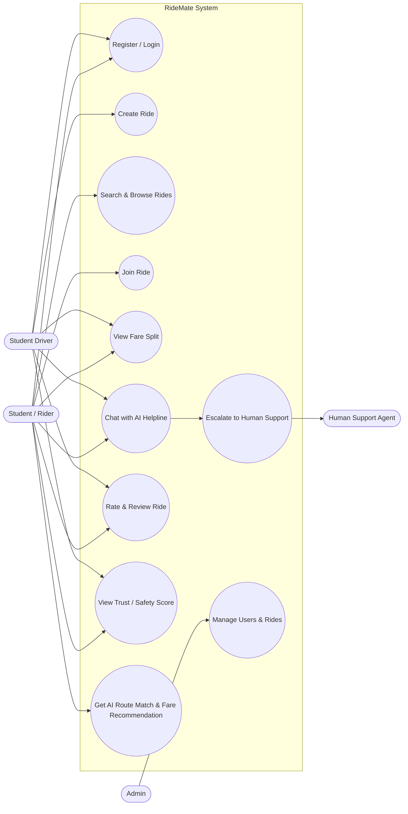

# RideMate — Use Case Diagram (Whole App)

Covers current (Sprint 1–2) and planned (Sprint 3–7) functionality. Renders natively on GitHub.

**Notes**
- `UC1` (Register/Login) and `UC11` (Manage Users & Rides) land in Sprint 3.
- `UC6`/`UC7` (AI Chatbox Helpline + human escalation) are the Sprint 1–2 focus, rule-based now, real-LLM upgrade in Sprint 4.
- `UC10` (AI route match & fare recommendation) covers the originally-listed AI matching features, deferred to Sprint 5–6.
